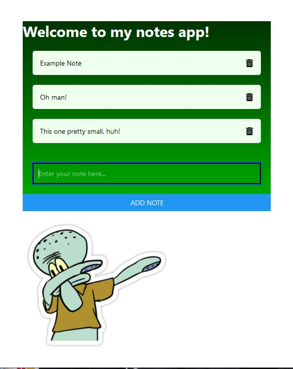
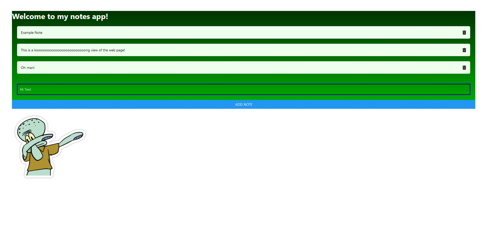

# Hack Technology / Project Attempted

## What you built? 

For this Hack-a-Thing, I planned to learn the basics of React Native, including state management, styling, interactivity, and core logic. To do this, I created a fairly basic notes app in which notes can be added and removed from the screen. I spent a majority of my time learning how state management works, as it differs from what I am used to, but managed to get something I am fairly happy with. In addition to basic functionality, I included a gradient and icon from external packages and an image added locally. 

Screenshots:

## Who Did What?

I worked on this project individually.

## What you learned

I struggled for a little bit with the parts of React Native that differ dramatically from their counterparts in Flutter, which I am much more used to. I found managing state (and ensuring that the corresponding View's change with the state) to be particularly tricky. Luckily, the concept of containers and flex / styling is almost the same between the two languages and I implemented that part of the UI very quickly. 

All of my work in Flutter has been for iOS and Android, so this project introduced me to web development and the environment used to quickly create and preview changes made to a website. I found React Native's development environment very intuitive and believe I will be well prepared to begin developing a real app in React Native if that is the direction that my project takes me.

## Authors

Thomas Lingard '22

## Acknowledgments

https://www.youtube.com/watch?v=00HFzh3w1B8

https://reactnative.dev/

https://www.kindacode.com/article/how-to-set-a-gradient-background-in-react-native/

https://www.tutorialspoint.com/react_native/react_native_images.htm
